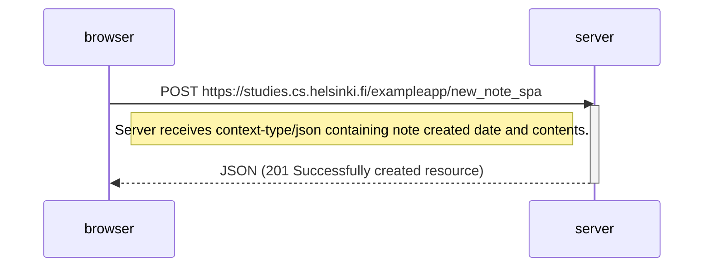

```mermaid
sequenceDiagram
    participant browser
    participant server

    browser->>server: POST https://studies.cs.helsinki.fi/exampleapp/new_note_spa
    activate server
    Note right of browser: Server receives context-type/json containing note created date and contents.
    server-->>browser: JSON (201 Successfully created resource)
    deactivate server
```
